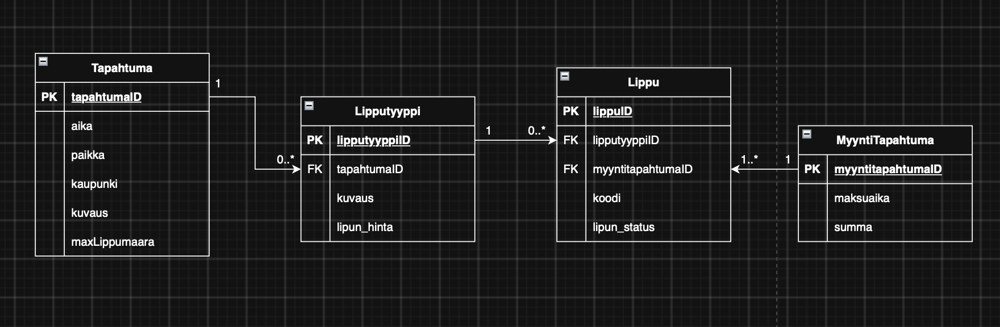

# Dokumentaatio

**Ryhmän nimi:** Sopivasti Satunnaiset

**Jäsenet:**
- Jaakko Eloranta
- Thu Dinh
- Antti Lehtonen
- Jere Ahonen
- Zwe Lin

## Johdanto
### Projektin tausta
TicketGuru on lipunmyyntijärjestelmä, joka suunnitellaan lipputoimiston käyttöön. Järjestelmän tarkoituksena on mahdollistaa tapahtumien hallinta sekä lippujen myynti ja tulostaminen lipunmyyntipisteessä. Järjestelmän avulla lipunmyyjä voi myydä asiakkaille lippuja eri tapahtumiin ja tulostaa ne asiakkaalle. 

Järjestelmän toinen keskeinen käyttötarkoitus on lippujen hallinta tapahtumien yhteydessä. Ennakkomyynnin päätyttyä jäljelle jääneet liput voidaan tulostss ovella myytäviksi. Lippuihin sisällytetään helposti tarkistettava koodi, jonka avulla voidaan tapahtuman ovella merkitä käytetyksi.

### Projektin tavoite
Projektin tavoitteena on toteuttaa toimiva lipunmyyntijärjestelmä, joka vastaa lipputoimiston tarpeisiin ja helpottaa lipunmyyntipisteen päivittäistä toimintaa. Järjestelmän tulee mahdollistaa tapahtumien ja lippujen hallinta sekä lippujen myynti ja tulostaminen.

Järjestelmän suunnittelussa huomioidaan myös mahdollinen jatkokehitys. Tulevaisuudessa TicketGuruun on tarkoitus lisätä verkkokauppa, jonka kautta asiakkaat voivat ostaa lippuja itsenäisesti. Tämä otetaan huomioon järjestelmän rakenteessa ja suunnittelussa jo projektin alkuvaiheessa.

Projektin käyttöliittymän suunnittelussa hyödynnetään tilaajan toimittamia alustavia wireframe-malleja. Wireframet toimivat suunnittelun tukena ja antavat suuntaa järjestelmän tärkeimpien käyttöliittymien rakenteesta ja toiminnallisuudesta. Niitä ei kuitenkaan käsitellä lopullisina käyttöliittymäsuunnitelmina vaan niitä voidaan muokata projektin edetessä määriteltyjen tarpeiden perusteella.

## Järjestelmän määrittely
- Käyttäjäroolit: Tapahtuman järjestäjä, asiakas ja lipuntarkastaja
1. Asiakas: "Haluan ostaa lipun haluamaani tapahtumaan."
 - Kirjautuu sisään palveluun.
 - Käy läpi tapahtuma listaa löytääkseen haluamansa.
 - Valitsee tapahtuman ja siirtyy lippu tyypin valintaan.
 - Maksutavan valinta lipun ostamiseen.
 - Siirtymä käyttäjän liput näkymään ja tulostukseen.
2. Lipunmyyjä: "Bändin osuus olisi mukava nähdä lipunmyynnissä."
 - Kirjautuu sisään järjestelmään myyjänä tapahtumat näkymlle.
 - Luo uuden tapahtuman.
 - Asettaa tapahtuman ajankohdan, paikan, kuvauksen, kaupunging sekä lippujen määrän.
 - Tarkentaa lippunäkymällä eri lippujen kuvauksen ja hinnan.
 - Käy tarkastamassa viime tapahtuman myyntiraportin.
3. Tapahtuma järjestäjä: "Olisi hyvä saada tapahtuman sivuihin jokin viittaus."
 - Kirjautuu sisään tapahtuma järjestäjänä.
 - Valitsee oman tapahtumansa.
 - Muokkaa ajankohdan muutoksen tulevaan tapahtumaan.
 - Tarkastaa samalla myytyjen lippujen määrän.
 - Valitsee menneen tapahtuman raportin näkeäkseen kokonaismyynnin.
## Käyttöliittymä
- Asiakas näkee lipunmyynnin ja tapahtumaluettelon.
- Myyjät näkevät tapahtumahallinnan ja myyntiraportin.

## Tietokanta
Lippu on määritelty kuulumaan aina pakollisesti yhteen myyntitapahtumaan. Näin jokaisella myydyllä lipulla on tieto siitä, mihin myyntitapahtumaan se kuuluu. Tämä tukee tietokannan eheyttä ja mahdollistaa esimerkiksi yksittäisen myynnin sisältämien lippujen tarkastelun. Myös tulevassa verkkokaupassa asiakkaan ostamat liput voidaan liittää samaan myyntitapahtumaan. Mikäli ovelle halutaan tulostaa lippuja ennakkoon ilman suoraa asiakaskontaktia, ne voidaan kirjata järjestelmään omana myyntitapahtumanaan ennen tulostusta. 

 

**Relaatiot**  
- __Tapahtuma 1:0..* Lipputyyppi__: Yhdellä tapahtumalla voi olla useita eri lipputyyppejä (esim. aikuinen, lapsi, eläkäinen ja opiskelija). Jokainen lipputyyppi kuuluu yhteen tapahtumaan.
- __Lipputyyppi 1:0..* Lippu__: Yhdestä lipputyypistä voidaan muodostaa useita yksittäisiä lippuja. Yksittäinen lippu perustuu aina yhteen lipputyyppiin ja sen hintaan. Jokaisella lipulla on lisäksi yksilöllinen koodi, jonka avulla lippu voidaan tarkistaa ja merkitä käytetyksi ovella.
- __Myyntitapahtuma 1:1..* Lippu__: Yksi myyntitapahtuma voi sisältää yhden tai useamman lipun. Myyntitapahtuma kokoaa samaan ostoon kuuluvat liput yhteen ja sisältää esimerkiksi maksuaijan ja myynnin kokonaissumman. Jokainen lippu kuuluu pakollisesti yhteen myyntitapahtumaan.